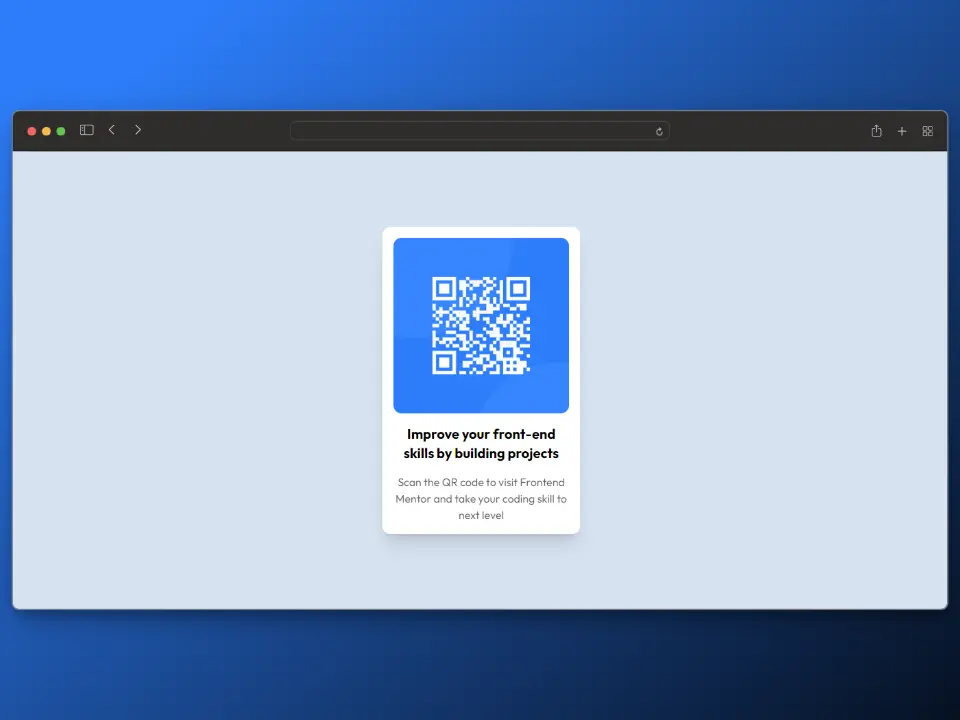

# Frontend Mentor - QR code component solution

This is a solution to the [QR code component challenge on Frontend Mentor](https://www.frontendmentor.io/challenges/qr-code-component-iux_sIO_H). Frontend Mentor challenges help you improve your coding skills by building realistic projects. 

### Screenshot

### Links

- Solution URL: [https://github.com/luislrivera/qr_code_component](https://github.com/luislrivera/qr_code_component)
- Live Site URL: [https://qr-code-component-seven-steel.vercel.app/](https://qr-code-component-seven-steel.vercel.app/)

### Built with

- Semantic HTML5 markup
- [Tailwind CSS](https://tailwindcss.com/)
- [Astro](https://astro.build/)
